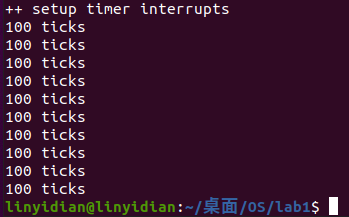
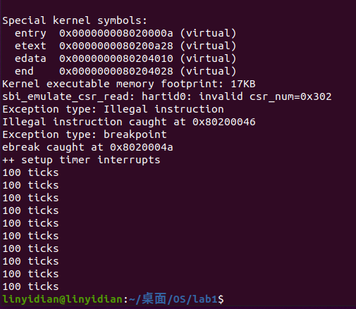

# lab1

## 练习1：理解内核启动中的程序入口操作
阅读 kern/init/entry.S内容代码，结合操作系统内核启动流程，说明指令`la sp,bootstacktop`完成了什么操作，目的是什么？`tail kern_init`完成了什么操作，目的是什么？

### 指令 `la sp,bootstacktop`

该指令将`bootstacktop`（`预定义为0000000080204000`）的值加载到`sp`栈指针寄存器。设置栈指针是为了确保后续的中断处理等能够正确地使用栈空间。

### 指令 `tail kern_init`

该指令用于跳转到`kern_init`函数，进而执行内核的初始化工作，例如启用时钟中断等。

## 练习2：完善中断处理

### 任务描述

请编程完善trap.c中的中断处理函数`trap()`，填写`interrupt_handler()`函数中处理时钟中断的部分，使操作系统每遇到100次时钟中断后，调用`print_ticks`子程序，向屏幕上打印一行文字”100 ticks”，在打印完10行后调用sbi.h中的`shut_down()`函数关机。

程序片段如下：
```c
case IRQ_S_TIMER:
    clock_set_next_event();
    ticks++;
    if(ticks==TICK_NUM)
    {
        print_ticks();
        ticks=0;
        num++;
        if(num==10) sbi_shutdown();
    }
    break;
```

运行结果如下：




## 扩展练习Challenge1：描述与理解中断流程
描述ucore中处理中断异常的流程（从异常的产生开始），其中mov a0，sp的目的是什么？SAVE_ALL中寄寄存器保存在栈中的位置是什么确定的？对于任何中断，__alltraps 中都需要保存所有寄存器吗？请说明理由。
### 中断处理流程
1. 异常产生之后，程序根据stvec，跳转到__alltraps。
2. 在__alltraps中保存上下文，存储32个通用寄存器和4个处理异常相关的寄存器，然后`move a0,sp`和`jal trap`跳转到`trap()`函数。
3. 在`trap()`函数中调用`trap_dispatch()`函数根据tf->cause(错误的类型)分别调用`interrupt_handler()`和`exception_handler()`,并根据具体错误类型进一步处理。
4. 在处理完毕之后前往__trapret，进行通用寄存器和部分处理异常相关的寄存器的恢复。

### `mov a0,sp`的目的
`mov a0,sp`用于将当前栈指针的值保存到参数寄存器中，此时`sp`指向trapframe结构体(内含通用寄存器和处理异常相关的寄存器)的首地址，a0在RISC-V中作为函数的第一个参数，因此这里实现了将trapframe结构体作为`trap()`函数的参数的功能。

### `SAVE_ALL`中寄存器保存位置
在`SAVE_ALL`中，通过`sp`开辟了大小为`36*REGBYTES`的栈空间，并将寄存器保存在其中。因此`SAVE_ALL`中寄存器在栈顶的36个`REGBYTES`中。

### 是否需要保存所有寄存器
在ucore的实现中统一保存了32个通用寄存器和4个处理异常相关的寄存器，但并非对于任何中断，所有的寄存器都需要被保存，所以在更高效的实现中可能可以考虑只保存部分的寄存器。

## 扩展练习Challenge2：理解上下文切换机制
在trapentry.S中汇编代码`csrw sscratch, sp；csrrw s0, sscratch, x0`实现了什么操作，目的是什么？save all里面保存了stval,scause这些csr，而在restore all里面却不还原它们？那这样store的意义何在呢？

#### `csrw sscratch, sp; csrrw s0, sscratch, x0`
将`sp`写入`sscratch`，然后再将`sscratch`写入`s0`，最后将`x0`（0号寄存器恒为0）写入`sscratch`。
目的是为了在栈中保存`addi sp, sp, -36 * REGBYTES`之前的`sp`(也就是进入异常处理之前的`sp`)，并将`sscratch`设置成0。

#### 保存与恢复`stval`和`scause`
在`save all`中保存`stval`和`scause`等CSR（控制状态寄存器）是为了在中断处理中使用其中的信息进行处理，因为在使用完之后这些信息不再具有价值，因此在restore all里面不还原它们。

## 扩展练习Challenge3：完善异常中断
编程完善：在触发非法指令异常mret和断点异常ebreak时，在 kern/trap/trap.c的异常处理函数中捕获，并对其进行处理，简单输出异常类型和异常指令触发地址，即“Illegal instruction caught at 0x(地址)”，“ebreak caught at 0x（地址）”与“Exception type:Illegal instruction"，“Exception type: breakpoint”。

程序片段如下：
```c
case CAUSE_ILLEGAL_INSTRUCTION:
    cprintf("Exception type: Illegal instruction\n");
    cprintf("Illegal instruction caught at 0x%08x\n", tf->epc);
    tf->epc+=4;
    break;
case CAUSE_BREAKPOINT:
    cprintf("Exception type: breakpoint\n");
    cprintf("ebreak caught at 0x%08x\n", tf->epc);
    tf->epc+=2;
    break;
```

运行结果如下：

