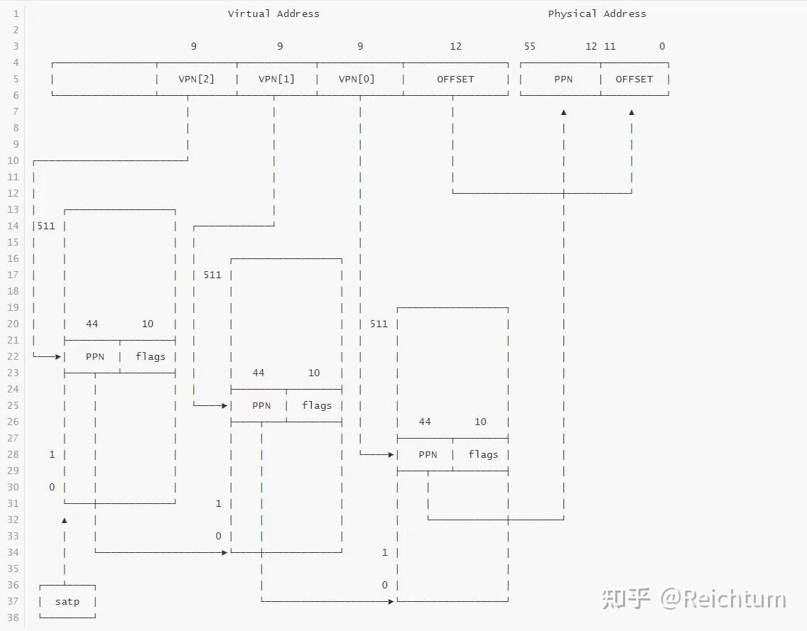

# lab3实验报告
该实验报告和完整代码已上传[github](https://github.com/1973315112/OS)

## 练习1：理解基于FIFO的页面替换算法（思考题）
描述FIFO页面置换算法下，一个页面从被换入到被换出的过程中，会经过代码里哪些函数/宏的处理（或者说，需要调用哪些函数/宏），并用简单的一两句话描述每个函数在过程中做了什么？（为了方便同学们完成练习，所以实际上我们的项目代码和实验指导的还是略有不同，例如我们将FIFO页面置换算法头文件的大部分代码放在了`kern/mm/swap_fifo.c`文件中，这点请同学们注意）
 - 至少正确指出10个不同的函数分别做了什么？如果少于10个将酌情给分。我们认为只要函数原型不同，就算两个不同的函数。要求指出对执行过程有实际影响,删去后会导致输出结果不同的函数（例如assert）而不是cprintf这样的函数。如果你选择的函数不能完整地体现”从换入到换出“的过程，比如10个函数都是页面换入的时候调用的，或者解释功能的时候只解释了这10个函数在页面换入时的功能，那么也会扣除一定的分数

### 1.trap--> trap_dispatch-->pgfault_handler-->do_pgfault
do_pgfault 函数用于处理页故障异常，通过查找或分配页面来恢复程序的正常执行。它会根据地址和错误代码查找对应的虚拟内存区域，并根据需要分配新页面或从磁盘加载页面内容。

### 2.trap--> trap_dispatch-->pgfault_handler-->do_pgfault-->find_vma
find_vma 函数用于在给定的内存管理结构 mm 中查找包含指定地址 addr 的虚拟内存区域 (VMA)。如果找到符合条件的 VMA，则返回该 VMA 的指针，并更新 mm 的缓存；如果找不到，则返回 NULL。

### 3.trap--> trap_dispatch-->pgfault_handler-->do_pgfault-->get_pte
get_pte 函数用于在三级页表结构中找到指定虚拟地址 la 的页表项（PTE）。如果对应的页表不存在且 create 为 true，则会逐级分配页表，确保最终返回一级页表中对应的 PTE 指针。

### 4.trap--> trap_dispatch-->pgfault_handler-->do_pgfault-->pgdir_alloc_page
pgdir_alloc_page 函数在页目录 pgdir 中分配一个物理页面并将其映射到虚拟地址 la，同时设置权限 perm。如果映射成功且支持交换管理，则将该页面标记为可交换页面，并记录其虚拟地址。若映射失败，则释放分配的页面并返回 NULL。

### 5.trap--> trap_dispatch-->pgfault_handler-->do_pgfault-->swap_in
swap_in 函数从交换文件系统中将存储在硬盘上的页面数据加载到内存。它首先为地址 addr 分配一个物理页面 result，然后使用 swapfs_read 将 addr 对应的交换条目读取到该页面中，并将页面指针返回给调用者 *ptr_result。这个过程使页面从交换区换入内存，以供后续访问。

### 6.trap--> trap_dispatch-->pgfault_handler-->do_pgfault-->page_insert
page_insert 函数将虚拟地址 la 映射到物理页面 page，并设置访问权限 perm。如果 la 已经有映射，函数会先删除旧映射，再建立新的映射。此外，该函数会更新页面的引用计数，并刷新 TLB 确保新映射生效。

### 7.trap--> trap_dispatch-->pgfault_handler-->do_pgfault-->page_insert-->page_remove_pte
page_remove_pte 函数用于解除虚拟地址 la 到物理页面的映射。它首先检查页表项是否有效，如果有效则减少该页面的引用计数；当引用计数为零时，释放页面内存。最后，函数清除页表项并刷新 TLB，以确保缓存中的旧映射失效。

### 8.pmm->alloc_pages-->swap_out
swap_out 函数用于将指定数量（n）的页面从内存换出到磁盘交换区。它循环调用 swap_out_victim(对应于 swap_fifo 中的_fifo_swap_out_victim) 选择要换出的页面，将页面内容写入交换区（通过 swapfs_write），然后解除页面映射并释放物理内存。如果写入成功，页表项更新为交换区位置，并刷新 TLB 确保旧的映射失效。函数返回成功换出的页面数量。

### 9.swap_manager->swap_out_victim(_fifo_swap_out_victim)
_fifo_swap_out_victim 函数实现了 FIFO 页面置换策略，用于选择最早进入的页面进行换出。它从 pra_list_head 链表中找到最先进入的页面，将其从链表中移除，并将页面指针设置到 *ptr_page。如果没有页面可供换出，则返回 NULL。

### 10.pmm->alloc_pages-->swap_out-->swapfs_write
swapfs_write 函数将页面数据写入交换区，它调用 ide_write_secs，将 page 页面内容写入磁盘的指定扇区。ide_write_secs 使用 memcpy 将页面数据从内存复制到模拟的磁盘位置，以 nsecs 为单位执行写操作，从而完成将页面数据保存到交换区的过程。

## 练习2：深入理解不同分页模式的工作原理（思考题）
get_pte()函数（位于`kern/mm/pmm.c`）用于在页表中查找或创建页表项，从而实现对指定线性地址对应的物理页的访问和映射操作。这在操作系统中的分页机制下，是实现虚拟内存与物理内存之间映射关系非常重要的内容。
 - get_pte()函数中有两段形式类似的代码， 结合sv32，sv39，sv48的异同，解释这两段代码为什么如此相像。
 - 目前get_pte()函数将页表项的查找和页表项的分配合并在一个函数里，你认为这种写法好吗？有没有必要把两个功能拆开？

### 两段相似代码的原因
在 RISC-V 架构中，sv32、sv39、sv48 是不同的分页模式，分别对应 32 位(二级页表)、39 位(三级页表)和 48 位(四级页表)虚拟地址空间。不同分页模式的页表层级不同，但总体结构是类似的，其由虚拟地址访问物理地址的过程如下：



在 sv39 模式下，三级页表结构会用到 39 位虚拟地址中的前 27 位（9 位 x 3），各层级的页表项查找方式和流程基本一致，因此出现了结构类似的代码。
- 第一级页表查找：计算虚拟地址的第一级索引 PDX1(la)，从 pgdir 获取第一级页表项 pdep1。如果 pdep1 无效（不存在或未分配），则调用 alloc_page() 为其分配一个物理页，并设置有效标志位。
- 第二级页表查找：将 pdep1 转换为虚拟地址，然后使用索引 PDX0(la) 获取第二级页表项 pdep0。如果 pdep0 无效，则类似于上一步，为其分配一个新页面。

### 你认为这种写法好吗？有没有必要把两个功能拆开？
我认为这个功能非常合理即简化了代码使用，又减少了重复逻辑。将查找和分配合并可以减少代码重复。每一级页表项查找之后立即检查有效性，若无效则创建新的页表项。在发生缺页异常时，get_pte() 可在一次函数调用中完成查找和分配，减少了不必要的函数调用开销，提高了性能。

## 练习3：给未被映射的地址映射上物理页（需要编程）
补充完成do_pgfault（mm/vmm.c）函数，给未被映射的地址映射上物理页。设置访问权限的时候需要参考页面所在 VMA 的权限，同时需要注意映射物理页时需要操作内存控制结构所指定的页表，而不是内核的页表。
请在实验报告中简要说明你的设计实现过程。请回答如下问题：
 - 请描述页目录项（Page Directory Entry）和页表项（Page Table Entry）中组成部分对ucore实现页替换算法的潜在用处。
 - 如果ucore的缺页服务例程在执行过程中访问内存，出现了页访问异常，请问硬件要做哪些事情？
- 数据结构Page的全局变量（其实是一个数组）的每一项与页表中的页目录项和页表项有无对应关系？如果有，其对应关系是啥？

### 补充代码
```c
int do_pgfault(struct mm_struct *mm, uint_t error_code, uintptr_t addr) {
    int ret = -E_INVAL;
    struct vma_struct *vma = find_vma(mm, addr);
    pgfault_num++;

    if (vma == NULL || vma->vm_start > addr) {
        cprintf("Invalid address %x, not found in VMA\n", addr);
        goto failed;
    }

    uint32_t perm = PTE_U;
    if (vma->vm_flags & VM_WRITE) {
        perm |= (PTE_R | PTE_W);
    }
    addr = ROUNDDOWN(addr, PGSIZE);
    ret = -E_NO_MEM;
    pte_t *ptep = get_pte(mm->pgdir, addr, 1);

    if (*ptep == 0) {  // 页面未分配
        if (pgdir_alloc_page(mm->pgdir, addr, perm) == NULL) {
            cprintf("Page allocation failed in do_pgfault\n");
            goto failed;
        }
    } else if (swap_init_ok) {  // 页表项指向交换区，需换入
        struct Page *page = NULL;
        swap_in(mm, addr, &page);  // 从交换区加载页面
        page_insert(mm->pgdir, page, addr, perm);
        swap_map_swappable(mm, addr, page, 1);
        page->pra_vaddr = addr;
    } else {
        cprintf("Page not in memory and swap not initialized, failed\n");
        goto failed;
    }

    ret = 0;
failed:
    return ret;
}
```
- swap_in(mm, addr, &page); 将交换区中指定地址 addr 对应的数据加载到一个新的物理页面 page 中。
- page_insert(mm->pgdir, page, addr, perm); 使用 page_insert 函数在页表中为地址 addr 建立映射，关联该物理页面，并设置页面的访问权限 perm。
- swap_map_swappable(mm, addr, page, 1); 将该页面标记为可交换，并加入页面替换算法的管理队列，表示可以在内存不足时换出。
- page->pra_vaddr = addr; 将虚拟地址 addr 存入 page 的 pra_vaddr 字段，以便替换算法可以在未来跟踪和管理该页面。

### 请描述页目录项（Page Directory Entry）和页表项（Page Table Entry）中组成部分对 ucore 实现页替换算法的潜在用处。

- PTE_A（Accessed 位）：指示页面是否被访问过。可以用于 CLOCK 或 LRU 算法中判断页面的访问频率，帮助选择需要换出的页面。
- PTE_D（Dirty 位）：指示页面是否被修改过。在替换算法中，PTE_D 可用于决定是否需要将页面内容写回磁盘，从而优化替换性能。

通过使用 PTE_A 和 PTE_D 位实现的改进型 CLOCK 算法优先淘汰未被修改且未被最近访问的页面，从而减少 I/O 操作次数。该算法将页表项中的访问位和修改位组合起来，按优先级选择淘汰页面（如优先淘汰 PTE_A=0 和 PTE_D=0 的页面）。

### 如果ucore的缺页服务例程在执行过程中访问内存，出现了页访问异常，请问硬件要做哪些事情？
- 存储异常地址：缺页地址会被保存在寄存器（cr2 寄存器）中。
- 设置错误代码：硬件将错误代码存储在指定寄存器中，描述错误的类型（如读写权限问题或页不存在）。
- 触发异常处理：CPU 跳转到操作系统的 Page Fault 处理例程，执行 trap -> trap_dispatch -> pgfault_handler -> do_pgfault 处理链。

### 数据结构 Page 的全局变量（其实是一个数组）的每一项与页表中的页目录项和页表项有无对应关系？如果有，其对应关系是啥？
``` c
struct Page {
    int ref;                        // page frame's reference counter
    uint_t flags;        // array of flags that describe the status of the page frame
    uint_t visited;
    unsigned int property;    // the num of free block, used in first fit pm manager
    list_entry_t page_link;         // free list link
    list_entry_t pra_page_link;     // used for pra (page replace algorithm)
    uintptr_t pra_vaddr;            // used for pra (page replace algorithm)
};
```
Page 结构体的每个实例对应一个物理页面，页表项间接映射到 Page，通过 page2pa 函数可获取物理页地址，pte2page 则可从页表项获取对应 Page 结构体。


## 练习4：补充完成Clock页替换算法（需要编程）
通过之前的练习，相信大家对FIFO的页面替换算法有了更深入的了解，现在请在我们给出的框架上，填写代码，实现 Clock页替换算法（mm/swap_clock.c）。
请在实验报告中简要说明你的设计实现过程。请回答如下问题：
 - 比较Clock页替换算法和FIFO算法的不同。

### 补充代码
``` c
static int _clock_init_mm(struct mm_struct *mm)
{     
    list_init(&pra_list_head);
    curr_ptr = &pra_list_head;
    mm->sm_priv = &pra_list_head;
    return 0;
}
```
初始化了 CLOCK 页面置换算法所需的链表 pra_list_head，并将 curr_ptr 设置为指向链表头，同时将 mm->sm_priv 指向链表头，方便后续通过 mm 访问这个链表，管理可交换的页面。

``` c
static int
_clock_map_swappable(struct mm_struct *mm, uintptr_t addr, struct Page *page, int swap_in)
{
    list_entry_t *entry=&(page->pra_page_link);
    assert(entry != NULL && curr_ptr != NULL);
    list_add_before((list_entry_t*)mm->sm_priv,entry);
    page->visited=1;
    return 0;
}
```
将页面添加到 CLOCK 算法的页面链表中，并将该页面的 visited 标志设置为 1，表示该页面已被访问。它将页面的链表节点插入到链表头部，表示该页面是新加入的，可以被替换。

``` c
static int
_clock_swap_out_victim(struct mm_struct *mm, struct Page ** ptr_page, int in_tick)
{
    list_entry_t *head=(list_entry_t*) mm->sm_priv;
    assert(head != NULL);
    assert(in_tick==0);
    while (1) {
        curr_ptr = list_next(curr_ptr);  
        if(curr_ptr==head) curr_ptr = list_next(curr_ptr);
        if(curr_ptr==head) 
        {
            *ptr_page = NULL;
            break;
        }
        struct Page* page = le2page(curr_ptr, pra_page_link);
        update_visited(page);
        if( page->visited==0 )
        {
            list_del(curr_ptr);
            *ptr_page = page;
            cprintf("curr_ptr %p\n",curr_ptr);
            break;
        }
        page->visited = 0;
    }
    return 0;
}
```
实现了 CLOCK 算法，选择一个页面进行置换。它遍历链表，检查每个页面的 visited 标志，若为 0（未被访问），则该页面被选中作为替换页面，并从链表中删除。如果页面被访问过，则将其 visited 标志重置为 0，继续检查下一个页面。

### 比较Clock页替换算法和FIFO算法的不同
- FIFO算法：按照页面进入内存的顺序替换页面，忽略页面的访问频率。最早进入内存的页面最先被淘汰。缺点是容易出现Belady 现象，即在增加内存页帧时，缺页次数反而增多，效率低，特别是在内存访问模式复杂时，常被频繁访问的页面可能被错误地替换。
- Clock 算法：通过访问位来模拟 LRU (最近最少使用) 算法。页面被组织成环形链表，访问位为 1 的页面被跳过，访问位为 0 的页面被淘汰。它在 FIFO 的基础上加入了页面访问情况的考虑，避免了频繁访问的页面被淘汰。Clock 算法比 FIFO 更加高效，减少了缺页异常的发生，并且避免了Belady 现象。

## 练习5：阅读代码和实现手册，理解页表映射方式相关知识（思考题）
如果我们采用”一个大页“ 的页表映射方式，相比分级页表，有什么好处、优势，有什么坏处、风险？

### 好处&优势
一个大页映射方式简化了页表管理，减少了页表层级，因此在查找物理地址时，CPU只需要一次查找即可直接获得物理地址，减少了查找延迟。与分级页表不同，分级页表需要多次查找（每一层页表都有一个查找过程），而一个大页的页表只需要操作一个简单的页表项，查找效率更高。由于大页的大小较大，能映射更多的连续内存区域，这对一些需要大量连续内存的应用来说非常有利。尤其是在科学计算、大数据处理等领域，大页减少了内存分配中的碎片化现象，提高了内存的利用率和性能。使用大页映射可以减少TLB（Translation Lookaside Buffer）缺失，因为每个TLB条目能映射更大的内存区域，降低了TLB命中率低导致的性能损失

### 坏处&风险
大页的管理不够灵活，对于内存需求较小的应用程序来说，使用一个大页可能会导致内存的浪费，因为如果程序只使用了大页的一小部分，剩余部分无法被其他程序利用，造成了内存碎片。由于每个大页所占的内存较大，系统在分配内存时可能会面临更高的内存压力，这对于内存紧张的系统尤为突出。在极端情况下，可能导致系统无法为多个程序分配足够的内存，从而降低了系统的整体可扩展性。使用大页还可能增加页错误的发生频率，因为每个大页包含更多的内存区域，如果程序访问的内存跨越多个大页，可能导致更多的页错误，需要频繁地从磁盘读取数据，增加了系统的开销。

## 扩展练习 Challenge：实现不考虑实现开销和效率的LRU页替换算法（需要编程）
challenge部分不是必做部分，不过在正确最后会酌情加分。需写出有详细的设计、分析和测试的实验报告。完成出色的可获得适当加分。

### 算法设计
LRU算法的核心思想是：每当访问一个页面时，标记它为最近使用的；当系统需要换出页面时，选择最久未被访问的页面进行换出。本实验的实现是依靠维护一个链表（pra_list_head），每次访问页面的时候LRU算法更新被访问页面移动到链表头，每次页面替换的时候，换出链表尾部的页面。

### 功能分析

#### 初始化LRU管理器
``` c
static int _lru_init_mm(struct mm_struct *mm)
{     
    list_init(&pra_list_head);
    curr_ptr = &pra_list_head;
    mm->sm_priv = &pra_list_head;
    return 0;
}
```
pra_list_head 是LRU页面链表的头节点，表示当前内存中所有已加载页面的访问顺序。链表的每个节点代表一个页面，节点的顺序代表页面的使用时间：链表头部的页面是最近被访问的，链表尾部的页面是最久未被访问的。
curr_ptr 是指向被替换页面的指针，起初指向链表的头部。

#### 映射可交换页面
``` c
static int _lru_map_swappable(struct mm_struct* mm, uintptr_t addr, struct Page* page, int swap_in)
{
    list_entry_t *entry = &(page->pra_page_link);
    list_add_after((list_entry_t*)mm->sm_priv, entry);  // 将页面插入链表
    page->visited = 1;  // 标记页面已被访问
    return 0;
}
```
每当一个页面被映射为可交换（即可以被换出）时，LRU算法会将其插入到链表中，表示该页面已经被访问过，并且可能在未来需要被换出。从页面结构体中获取链表节点pra_page_link，使用list_add_after()函数将该页面插入到链表头部，将页面的visited标志设置为1，表示页面已经被访问。

#### 选择“受害者”页面
``` c
static int _lru_swap_out_victim(struct mm_struct* mm, struct Page** ptr_page, int in_tick)
{
    list_entry_t *head = (list_entry_t*) mm->sm_priv;  // 获取链表头部
    curr_ptr = list_prev(head);  // 获取链表尾部的前一个节点
    if (curr_ptr == head) {
        *ptr_page = NULL;  // 如果链表为空，返回NULL
        return 0;
    }
    struct Page* page = le2page(curr_ptr, pra_page_link);  // 获取受害者页面
    list_del(curr_ptr);  // 从链表中删除该页面
    *ptr_page = page;  // 返回被替换的页面
    return 0;
}
```
当系统需要进行页面换出时，LRU算法会选择链表尾部的页面作为“受害者页面”，即最久未被访问的页面。_lru_swap_out_victim()函数通过删除链表尾部的页面，完成页面的替换。首先访问链表的尾节点，如果链表为空，则返回NULL，表示没有页面可换出，否则，从链表中删除该页面，并返回该页面的指针作为被换出的页面。

#### 更新LRU链表
``` c
static void lru_update_list(size_t x)
{
    list_entry_t *now = list_next(&pra_list_head);
    while (now != (&pra_list_head)) {
        struct Page* page = le2page(now, pra_page_link);
        if (x == page->pra_vaddr) {  // 找到对应的页面
            page->visited = 0;  // 重置访问标志
            break;
        }
        now = list_next(now);
    }
    if (now == (&pra_list_head)) return;
    list_del(now);  // 从当前链表中删除该页面
    list_add_after(&pra_list_head, now);  // 将页面插入链表头部
}
```
每当一个页面被访问时，我们需要将该页面移动到链表的头部，表示该页面是最近使用的。lru_update_list()函数通过遍历链表，找到对应的页面并将其移到链表头部。遍历链表，找到访问的页面，将页面从当前位置删除，并将其插入到链表的头部，表示它是最近被访问的页面。

### 测试
#### 测试代码
``` c
/*
 * 功能: LRU管理器的自检程序
 */
static int _lru_check_swap(void) {
#ifdef ucore_test
    int score = 0, totalscore = 5;
    cprintf("%d\n", &score);
    ++ score; cprintf("grading %d/%d points", score, totalscore);
    *(unsigned char *)0x3000 = 0x0c;
    assert(pgfault_num==4);
    *(unsigned char *)0x1000 = 0x0a;
    assert(pgfault_num==4);
    *(unsigned char *)0x4000 = 0x0d;
    assert(pgfault_num==4);
    *(unsigned char *)0x2000 = 0x0b;
    ++ score; cprintf("grading %d/%d points", score, totalscore);
    assert(pgfault_num==4);
    *(unsigned char *)0x5000 = 0x0e;
    assert(pgfault_num==5);
    *(unsigned char *)0x2000 = 0x0b;
    assert(pgfault_num==5);
    ++ score; cprintf("grading %d/%d points", score, totalscore);
    *(unsigned char *)0x1000 = 0x0a;
    assert(pgfault_num==5);
    *(unsigned char *)0x2000 = 0x0b;
    assert(pgfault_num==5);
    *(unsigned char *)0x3000 = 0x0c;
    assert(pgfault_num==5);
    ++ score; cprintf("grading %d/%d points", score, totalscore);
    *(unsigned char *)0x4000 = 0x0d;
    assert(pgfault_num==5);
    *(unsigned char *)0x5000 = 0x0e;
    assert(pgfault_num==5);
    assert(*(unsigned char *)0x1000 == 0x0a);
    *(unsigned char *)0x1000 = 0x0a;
    assert(pgfault_num==6);
    ++ score; cprintf("grading %d/%d points", score, totalscore);
#else 
    // 注意:本测试样例仅作为示例，在真正有效的LRU换页机制中应实现每次内存访问
    //     都能自动执行lru_update_list()函数
    //cprintf("[调试信息]进入_lru_check_swap\n");
    testprint();
    // 4321
    //----------------------------------------
    __asm__ __volatile__("fence");
    *(unsigned char *)0x3000 = 0x0c;
    __asm__ __volatile__("fence");
    lru_update_list(0x3000);
    __asm__ __volatile__("fence");
    testprint();
    __asm__ __volatile__("fence");
    assert(pgfault_num==4);
    // 3421
    //----------------------------------------
    __asm__ __volatile__("fence");
    *(unsigned char *)0x1000 = 0x0a;
    __asm__ __volatile__("fence");
    lru_update_list(0x1000);
    __asm__ __volatile__("fence");
    testprint();
    __asm__ __volatile__("fence");
    assert(pgfault_num==4);
    // 1342
    //----------------------------------------
    __asm__ __volatile__("fence");
    *(unsigned char *)0x4000 = 0x0d;
    __asm__ __volatile__("fence");
    lru_update_list(0x4000);
    __asm__ __volatile__("fence");
    testprint();
    __asm__ __volatile__("fence");
    assert(pgfault_num==4);
    // 4132
    //----------------------------------------
    __asm__ __volatile__("fence");
    *(unsigned char *)0x2000 = 0x0b;
    __asm__ __volatile__("fence");
    lru_update_list(0x2000);
    __asm__ __volatile__("fence");
    testprint();
    __asm__ __volatile__("fence");
    assert(pgfault_num==4);
    // 2413
    //----------------------------------------
    __asm__ __volatile__("fence");
    *(unsigned char *)0x5000 = 0x0e;
    __asm__ __volatile__("fence");
    lru_update_list(0x5000);
    __asm__ __volatile__("fence");
    testprint();
    __asm__ __volatile__("fence");
    assert(pgfault_num==5);
    // 5241 3->5
    //----------------------------------------
    __asm__ __volatile__("fence");
    *(unsigned char *)0x2000 = 0x0b;
    __asm__ __volatile__("fence");
    lru_update_list(0x2000);
    __asm__ __volatile__("fence");
    testprint();
    __asm__ __volatile__("fence");
    assert(pgfault_num==5);
    // 2541
    //----------------------------------------
    __asm__ __volatile__("fence");
    *(unsigned char *)0x1000 = 0x0a;
    __asm__ __volatile__("fence");
    lru_update_list(0x1000);
    __asm__ __volatile__("fence");
    testprint();
    __asm__ __volatile__("fence");
    assert(pgfault_num==5);
    // 1254
    //----------------------------------------
    __asm__ __volatile__("fence");
    *(unsigned char *)0x2000 = 0x0b;
    __asm__ __volatile__("fence");
    lru_update_list(0x2000);
    __asm__ __volatile__("fence");
    testprint();
    __asm__ __volatile__("fence");
    assert(pgfault_num==5);
    // 2154
    //----------------------------------------
    __asm__ __volatile__("fence");
    *(unsigned char *)0x3000 = 0x0c;
    __asm__ __volatile__("fence");
    lru_update_list(0x3000);
    __asm__ __volatile__("fence");
    testprint();
    __asm__ __volatile__("fence");
    assert(pgfault_num==6);
    // 3215 4->3
    //----------------------------------------
    __asm__ __volatile__("fence");
    *(unsigned char *)0x4000 = 0x0d;
    __asm__ __volatile__("fence");
    lru_update_list(0x4000);
    __asm__ __volatile__("fence");
    testprint();
    __asm__ __volatile__("fence");
    assert(pgfault_num==7);
    // 4321 5->4
    //----------------------------------------
    __asm__ __volatile__("fence");
    *(unsigned char *)0x5000 = 0x0e;
    __asm__ __volatile__("fence");
    lru_update_list(0x5000);
    __asm__ __volatile__("fence");
    testprint();
    __asm__ __volatile__("fence");
    assert(pgfault_num==8);
    // 5432 1->5
    //----------------------------------------
    __asm__ __volatile__("fence");
    assert(*(unsigned char *)0x1000 == 0x0a);
    __asm__ __volatile__("fence");
    lru_update_list(0x1000);
    __asm__ __volatile__("fence");
    testprint();
    __asm__ __volatile__("fence");
    assert(pgfault_num==9);
    // 1543 2->1
    //----------------------------------------
    __asm__ __volatile__("fence");
    *(unsigned char *)0x1000 = 0x0a;
    __asm__ __volatile__("fence");
    lru_update_list(0x1000);
    __asm__ __volatile__("fence");
    testprint();
    __asm__ __volatile__("fence");
    assert(pgfault_num==9);
    // 1543
    //----------------------------------------
#endif
    return 0;
}
```
#### 测试结果
``` c
set up init env for check_swap over!
[调试信息]:当前LRU链表为:0x4000 0x3000 0x2000 0x1000 
[调试信息]将0x3000放到链表的首部
[调试信息]:当前LRU链表为:0x3000 0x4000 0x2000 0x1000 
[调试信息]将0x1000放到链表的首部
[调试信息]:当前LRU链表为:0x1000 0x3000 0x4000 0x2000 
[调试信息]将0x4000放到链表的首部
[调试信息]:当前LRU链表为:0x4000 0x1000 0x3000 0x2000 
[调试信息]将0x2000放到链表的首部
[调试信息]:当前LRU链表为:0x2000 0x4000 0x1000 0x3000 
Store/AMO page fault
page fault at 0x00005000: K/W
curr_ptr 0xffffffffc0225938
swap_out: i 0, store page in vaddr 0x3000 to disk swap entry 4
[调试信息]将0x5000放到链表的首部
[调试信息]:当前LRU链表为:0x5000 0x2000 0x4000 0x1000 
[调试信息]将0x2000放到链表的首部
[调试信息]:当前LRU链表为:0x2000 0x5000 0x4000 0x1000 
[调试信息]将0x1000放到链表的首部
[调试信息]:当前LRU链表为:0x1000 0x2000 0x5000 0x4000 
[调试信息]将0x2000放到链表的首部
[调试信息]:当前LRU链表为:0x2000 0x1000 0x5000 0x4000 
Store/AMO page fault
page fault at 0x00003000: K/W
curr_ptr 0xffffffffc0225980
swap_out: i 0, store page in vaddr 0x4000 to disk swap entry 5
swap_in: load disk swap entry 4 with swap_page in vadr 0x3000
[调试信息]将0x3000放到链表的首部
[调试信息]:当前LRU链表为:0x3000 0x2000 0x1000 0x5000 
Store/AMO page fault
page fault at 0x00004000: K/W
curr_ptr 0xffffffffc0225938
swap_out: i 0, store page in vaddr 0x5000 to disk swap entry 6
swap_in: load disk swap entry 5 with swap_page in vadr 0x4000
[调试信息]将0x4000放到链表的首部
[调试信息]:当前LRU链表为:0x4000 0x3000 0x2000 0x1000 
Store/AMO page fault
page fault at 0x00005000: K/W
curr_ptr 0xffffffffc02258a8
swap_out: i 0, store page in vaddr 0x1000 to disk swap entry 2
swap_in: load disk swap entry 6 with swap_page in vadr 0x5000
[调试信息]将0x5000放到链表的首部
[调试信息]:当前LRU链表为:0x5000 0x4000 0x3000 0x2000 
Load page fault
page fault at 0x00001000: K/R
curr_ptr 0xffffffffc02258f0
swap_out: i 0, store page in vaddr 0x2000 to disk swap entry 3
swap_in: load disk swap entry 2 with swap_page in vadr 0x1000
[调试信息]将0x1000放到链表的首部
[调试信息]:当前LRU链表为:0x1000 0x5000 0x4000 0x3000 
[调试信息]将0x1000放到链表的首部
[调试信息]:当前LRU链表为:0x1000 0x5000 0x4000 0x3000 
count is 1, total is 8
check_swap() succeeded!
```
